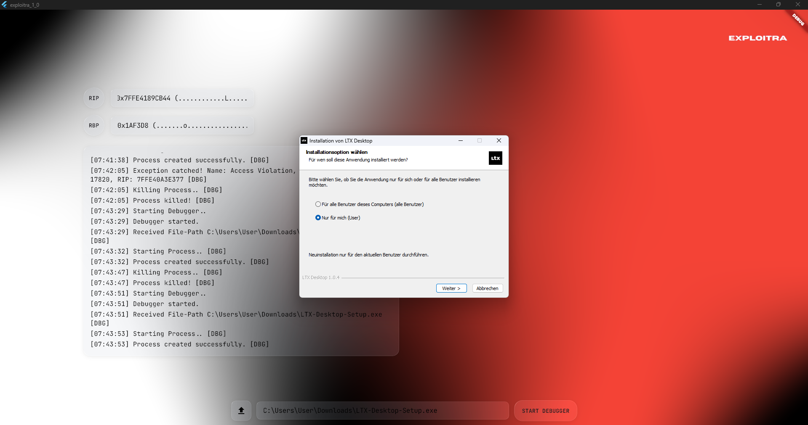
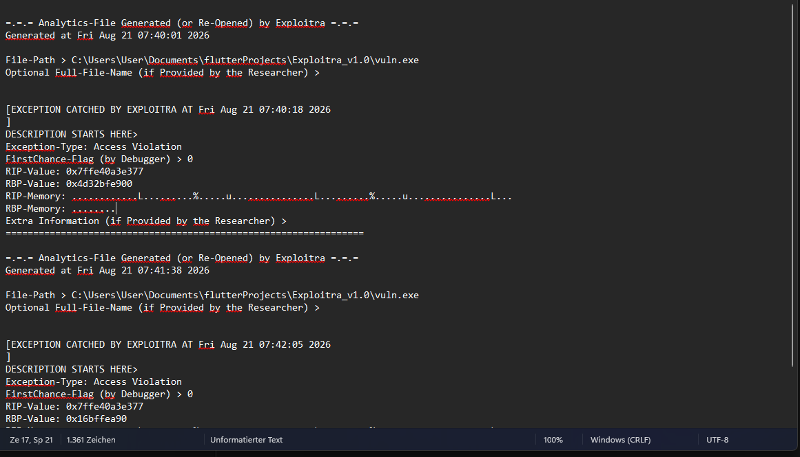

# expl0itra

> A lightweight Windows binary debugger with a live register viewer, memory reader, and automatic crash analytics — built with Flutter + C++.


---

## What it does

expl0itra wraps the Windows Debug API around any `.exe` you point it at. It attaches as a debugger, streams live RIP/RBP register values while the target runs, reads the memory content at those addresses, and on crash it writes a structured analytics file next to the binary — ready for offline analysis.

Key features:

- **Live RIP / RBP tracking** — register values and the ASCII content at those addresses update in real-time while the process runs
- **Crash detection** — catches all second-chance exceptions (Access Violation, Stack Overflow, Heap Corruption, etc.) with full context
- **Memory reader** — reads and displays printable ASCII content at RIP/RBP; falls back to the raw register bytes if the address is invalid (e.g. after a stack smash)
- **VirusTotal pre-check** — SHA-256 hash of the binary is computed and opened in VirusTotal before execution
- **Auto analytics file** — on crash, a `.txt` report is written alongside the binary with exception type, RIP/RBP values, memory snapshots and timestamp
- **Glass UI** — Flutter desktop frontend with animated mesh gradient and liquid glass widgets

---

## Screenshots

### Main Interface


### Crash Captured — Buffer Overflow Example


---

## Architecture

```
expl0itra (Flutter GUI)
│
├── startDebugger()          launches expltr_dbg.exe as subprocess
├── stdin  ──────────────►  file path of target binary
└── stdout ◄──────────────  RIP_VAL / RBP_VAL / DBG log lines
                             parsed by regex, displayed live

expltr_dbg.exe (C++ Debug Engine)
│
├── CreateProcessA()         spawns target with DEBUG_ONLY_THIS_PROCESS
├── WaitForDebugEvent()      50ms timeout loop
├── SuspendThread()          snapshots thread context between events
├── GetThreadContext()       reads RIP, RBP
├── ReadProcessMemory()      reads memory at those addresses
├── VirtualQueryEx()         validates address before read
└── fstream analytics        writes .txt report on second-chance exception
```

---

## Building

### Prerequisites

- Windows 10/11 x64
- Flutter SDK (`flutter doctor` should pass for Windows Desktop)
- MSVC 2022 **or** MinGW-w64 (GCC)

### C++ Backend (`expltr_dbg.exe`)

**MSVC:**
```bash
cl expltr_dbg.cpp /O2 /EHsc /Fe:expltr_dbg.exe shell32.lib
```

**GCC / MinGW:**
```bash
g++ expltr_dbg.cpp -o expltr_dbg.exe -O2 -lshell32 -lole32
```

> Place `expltr_dbg.exe` in the same directory as the Flutter build output.

### Flutter Frontend

```bash
flutter pub get
flutter build windows --release
```

The build output lands in `build\windows\x64\runner\Release\`. Copy `expltr_dbg.exe` there.

---

## Usage

1. Launch `expl0itra.exe`
2. Click the upload button and select any Windows `.exe`
3. Optionally run a VirusTotal scan when prompted
4. Click **START DEBUGGER**
5. Watch RIP / RBP update live in the register fields
6. On crash — the log panel shows the exception type and a `.txt` analytics file is written next to the target binary

---

## Analytics File Format

```
=.=.= Analytics-File Generated (or Re-Opened) by Exploitra =.=.=
Generated at Thu Aug 21 14:05:41 2025
File-Path > C:\Users\User\Downloads\logkeeper_test.exe

[EXCEPTION CATCHED BY EXPLOITRA AT Thu Aug 21 14:06:20 2025]
DESCRIPTION STARTS HERE>
Exception-Type: Access Violation
FirstChance-Flag (by Debugger) > 0
RIP-Value: 0x7FF6F08D16B4
RBP-Value: 0x6464646464646464
RIP-Memory: .UH..0...H..$....H......H......
RBP-Memory: dddddddd
Extra Information (if Provided by the Researcher) >
=================================================================
```

---

## Overflow Testing Example

To produce a clean RIP/RBP overwrite visible in expl0itra, compile a vulnerable binary **without stack canary**:

```c
// vuln.c
#include <stdio.h>
#include <string.h>

void vulnerable(char* input) {
    char buf[64];
    strcpy(buf, input);
}

int main() {
    char input[512];
    fgets(input, sizeof(input), stdin);
    vulnerable(input);
    return 0;
}
```

```bash
gcc vuln.c -o vuln.exe -fno-stack-protector -m64 -O0
```

Input:
```
python -c "print('A'*64 + 'B'*8 + 'C'*8)" | vuln.exe
```

Expected output in expl0itra:
```
RIP: 0x4343434343434343  (CCCCCCCC)
RBP: 0x4242424242424242  (BBBBBBBB)
```

---

## Known Limitations

- Targets must be native x64 Windows PE binaries — no .NET, no 32-bit
- `expltr_dbg.exe` requires administrator privileges for `OpenProcess` with `PROCESS_VM_READ`
- RIP content will always appear as opcode bytes (not readable text) since it points to code — this is expected behavior

---

## License

MIT — do whatever you want, don't hold me liable.

---

*Built by [KernelPhantom-010](https://github.com/KernelPhantom-010)*
